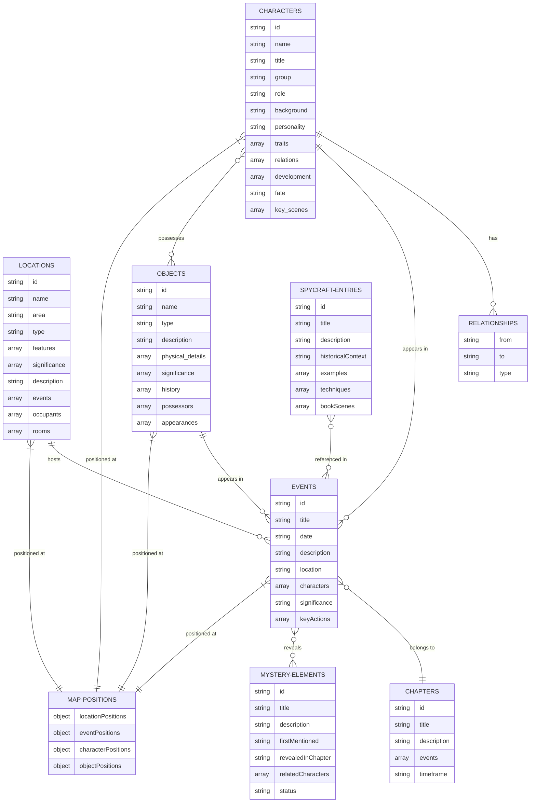

# Stitched Up Companion - Data Model and Relationships

This diagram illustrates the data model of the Stitched Up Companion app, showing the relationships between different data entities.

## Data Entities

The data model consists of several interconnected entities:

- **CHARACTERS**: People in the novel, including protagonists, antagonists, and supporting characters
- **LOCATIONS**: Places where events happen, with geographical information
- **EVENTS**: Things that happen in the story, involving characters and locations
- **RELATIONSHIPS**: Connections between characters (family, colleagues, enemies, etc.)
- **OBJECTS**: Important items in the story
- **SPYCRAFT-ENTRIES**: Encyclopedia entries about espionage techniques
- **CHAPTERS**: Sections of the book's narrative
- **MYSTERY-ELEMENTS**: Plot elements that are gradually revealed
- **MAP-POSITIONS**: Geographical coordinates for map visualization

## Key Relationships

The diagram shows how these entities are connected:

- Characters have relationships with other characters
- Characters appear in events
- Events take place at locations
- Events belong to chapters in the narrative
- Objects appear in events and can be possessed by characters
- Mystery elements are revealed through events
- Spycraft entries are referenced in events
- Geographic positions connect entities to the map

This rich interconnected data model allows users to explore the novel from multiple angles and follow threads through the narrative.
