# Stitched Up Companion - Directory Structure

This diagram shows the organization of files and directories in the Stitched Up Companion project, providing an overview of the codebase structure.

```mermaid
graph TD
    Root["/"] --> Public["public/"]
    Root --> Src["src/"]
    Root --> Docs["docs/"]
    Root --> Build["build/"]
    Root --> PackageJSON["package.json"]
    Root --> PCSS["postcss.config.js"]
    Root --> TCSS["tailwind.config.js"]
    Root --> README["README.md"]
    
    Docs --> DataFormat["data_format_documentation.md"]
    Docs --> DesignDoc["design_document.md"]
    Docs --> Analysis["stitchedUpAnalysis.md"]
    
    Src --> SrcAssets["assets/"]
    Src --> SrcComponents["components/"]
    Src --> SrcData["data/"]
    Src --> SrcStyles["styles/"]
    Src --> AppJS["App.js"]
    Src --> IndexJS["index.js"]
    
    SrcComponents --> CharExplorer["CharacterExplorer.js"]
    SrcComponents --> RelationshipWeb["RelationshipWeb.js"]
    SrcComponents --> Timeline["Timeline.js"]
    SrcComponents --> LocExplorer["LocationExplorer.js"]
    SrcComponents --> InteractiveMap["InteractiveMap.js"]
    SrcComponents --> PlotNavigator["PlotNavigator.js"]
    SrcComponents --> ObjectGallery["ObjectGallery.js"]
    SrcComponents --> SpycraftEncyclopedia["SpycraftEncyclopedia.js"]
    SrcComponents --> AppTour["AppTour.js"]
    SrcComponents --> AppTourCSS["AppTour.css"]
    
    SrcData --> DataIndex["index.js"]
    SrcData --> StitchedUp["stitchedUp/"]
    SrcData --> XMLFile["stitchedup-incomplete.xml"]
    
    StitchedUp --> SUIndex["index.js"]
    StitchedUp --> SUCharacters["characters.js"]
    StitchedUp --> SULocations["locations.js"]
    StitchedUp --> SUEvents["events.js"]
    StitchedUp --> SUObjects["objects.js"]
    StitchedUp --> SURelationships["relationships.js"]
    StitchedUp --> SUPositions["positions.js"]
    StitchedUp --> SUMysteryElements["mysteryElements.js"]
    StitchedUp --> SUChapters["chapters.js"]
    StitchedUp --> SUSpycraftEntries["spycraftEntries.js"]
    StitchedUp --> SUThemeElements["themeElements.js"]
    
    SrcStyles --> EnhancedTabs["enhanced-tabs.css"]
    
    class Root,Src,SrcComponents,SrcData,StitchedUp primaryNodes
    
    classDef primaryNodes fill:#f9d,stroke:#333,stroke-width:2px
    classDef secondaryNodes fill:#ddf,stroke:#333,stroke-width:1px
    classDef fileNodes fill:#dfd,stroke:#333,stroke-width:1px
    
    class Root,Src,SrcComponents,SrcData,StitchedUp primaryNodes
    class Public,Docs,SrcAssets,SrcStyles,Build secondaryNodes
    class CharExplorer,RelationshipWeb,Timeline,LocExplorer,InteractiveMap,PlotNavigator,ObjectGallery,SpycraftEncyclopedia,AppTour,AppTourCSS,DataIndex,XMLFile,SUIndex,SUCharacters,SULocations,SUEvents,SUObjects,SURelationships,SUPositions,SUMysteryElements,SUChapters,SUSpycraftEntries,SUThemeElements,EnhancedTabs,PackageJSON,PCSS,TCSS,README,DataFormat,DesignDoc,Analysis fileNodes
```

## Key Directory Structure

The project follows a standard React application structure:

- **Root**: Contains configuration files and the main directories
- **src/**: Contains all the source code
  - **components/**: React components for each aspect of the application
  - **data/**: Data files for the novel content
    - **stitchedUp/**: Directory with data specific to the "Stitched Up" novel
  - **styles/**: CSS and styling files
  - **App.js**: Main application component
  - **index.js**: Entry point of the application

## Component Organization

Each tab in the application has its own component file in the components directory. Additional utility components like AppTour are also located here.

## Data Organization

The data is organized in a modular structure with domain-specific files:

- **index.js**: Exports all data as a namespace
- **stitchedUp/**: Contains data specific to the "Stitched Up" novel
  - **characters.js**: Character data and relationships
  - **locations.js**: Location data and descriptions
  - **events.js**: Event data and timeline information
  - **objects.js**: Object data and significance
  - **relationships.js**: Character relationship mappings
  - **positions.js**: Geographic coordinates for map visualization
  - **mysteryElements.js**: Mystery-specific plot elements
  - **chapters.js**: Chapter information and structure
  - **spycraftEntries.js**: Spycraft technique data
  - **themeElements.js**: Thematic elements and motifs
  - **index.js**: Exports all data from the separate files

## Configuration Files

- **package.json**: Lists dependencies and scripts
- **postcss.config.js**: Configuration for PostCSS
- **tailwind.config.js**: Configuration for Tailwind CSS

This structure is designed to be easily extensible for additional books or content in the future, with each data type organized in its own file for better maintainability.
