# Stitched Up Companion - Project Architecture

This diagram illustrates the architecture of the Stitched Up Companion app, showing the main components, data flow, and relationships between different parts of the application.

```mermaid
graph TD
    A[App.js - Main Container] --> B[CharacterExplorer]
    A --> C[RelationshipWeb]
    A --> D[Timeline]
    A --> E[LocationExplorer]
    A --> F[InteractiveMap]
    A --> G[PlotNavigator]
    A --> H[ObjectGallery]
    A --> I[SpycraftEncyclopedia]
    A --> J[AppTour]

    %% Data Structure and Flow
    K[Data Layer] --> K1[stitchedUp/data.js]
    K1 --> K2[characters]
    K1 --> K3[locations]
    K1 --> K4[events]
    K1 --> K5[objects]
    K1 --> K6[relationships]
    K1 --> K7[spycraftEntries]
    K1 --> K8[chapters]
    K1 --> K9[mysteryElements]
    
    %% Map positions 
    L[Map Data] --> L1[positions.js]
    L1 --> L2[locationPositions]
    L1 --> L3[eventPositions]
    L1 --> L4[characterPositions]
    L1 --> L5[objectPositions]
    
    %% Data flows to components
    K2 --> B
    K2 --> C
    K2 --> D
    K3 --> E
    K3 --> F
    K4 --> D
    K5 --> H
    K6 --> C
    K7 --> I
    K8 --> G
    K9 --> G
    
    L2 --> F
    L3 --> F
    L4 --> F
    L5 --> F
    
    %% Component Features
    B --> B1[Character Filtering]
    B --> B2[Character Details]
    B --> B3[Character Relationships]
    
    C --> C1[Relationship Network Visualization]
    C --> C2[Filtering by Relationship Type]
    C --> C3[Character Selection]
    
    D --> D1[Chronological Event Display]
    D --> D2[Event Details]
    D --> D3[Event Filtering]
    
    E --> E1[Location Listing]
    E --> E2[Location Details]
    E --> E3[Location Events]
    
    F --> F1[Map Visualization]
    F --> F2[Location/Event Markers]
    F --> F3[Time Filtering]
    F --> F4[Element Selection]
    
    G --> G1[Plot Structure]
    G --> G2[Chapter Navigation]
    G --> G3[Mystery Elements]
    
    H --> H1[Object Catalog]
    H --> H2[Object History]
    H --> H3[Object Relationships]
    
    I --> I1[Spycraft Techniques]
    I --> I2[Historical Context]
    I --> I3[Book References]
    
    %% Cross-Component Communication
    A --- M[State Management]
    M --> M1[selectedCharacter]
    M --> M2[selectedLocation]
    M --> M3[selectedEvent] 
    M --> M4[selectedObject]
    
    %% User Interactions
    Z[User Interactions] --> Z1[Tab Navigation]
    Z --> Z2[Selection Across Tabs]
    Z --> Z3[Filtering Content]
    Z --> Z4[Map Exploration]
    Z --> Z5[App Tour]
    
    %% Styling
    Y[Styling] --> Y1[Tailwind CSS]
    Y --> Y2[Enhanced Tabs]
    Y --> Y3[Responsive Layout]

    %% Current Selection Summary Panel
    A --> X[Current Selections Panel]
    M1 --> X
    M2 --> X
    M3 --> X
    M4 --> X
    
    classDef core fill:#f9f,stroke:#333,stroke-width:2px
    classDef data fill:#bbf,stroke:#333,stroke-width:1px
    classDef component fill:#bfb,stroke:#333,stroke-width:1px
    classDef feature fill:#ffe,stroke:#333,stroke-width:1px
    
    class A,M core
    class K,K1,K2,K3,K4,K5,K6,K7,K8,K9,L,L1,L2,L3,L4,L5 data
    class B,C,D,E,F,G,H,I,J,X component
    class B1,B2,B3,C1,C2,C3,D1,D2,D3,E1,E2,E3,F1,F2,F3,F4,G1,G2,G3,H1,H2,H3,I1,I2,I3,M1,M2,M3,M4,Z1,Z2,Z3,Z4,Z5,Y1,Y2,Y3 feature
```

## Key Components

- **App.js (Main Container)**: Central component that manages the application state and navigation
- **Tab Components**: Specialized views for different aspects of the novel (Characters, Timeline, etc.)
- **Data Layer**: Structured data in JavaScript modules that power the application
- **State Management**: Handles cross-component communication and selection state
- **Current Selections Panel**: Provides cross-reference between different views

## Data Flow

The diagram shows how data flows from the data files into the various components, and how user interactions with these components affect the application state.
