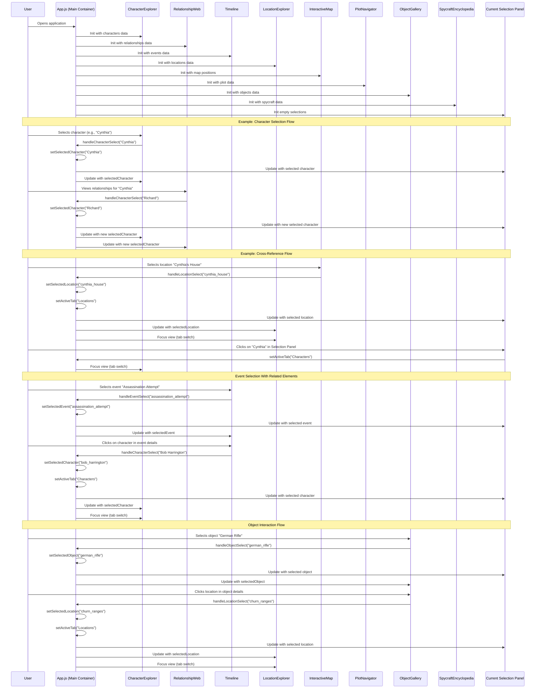

# Stitched Up Companion - State Management and Component Interaction

This sequence diagram illustrates how the components in the Stitched Up Companion app interact with each other and how state is managed throughout the application.

## State Management Overview

The application uses React's state management through the main App.js component:

1. **Initialization**:
   - The App.js component loads all data and passes it to child components
   - Initial state for selections is empty

2. **State Variables**:
   - `selectedCharacter`: Currently selected character
   - `selectedLocation`: Currently selected location
   - `selectedEvent`: Currently selected event
   - `selectedObject`: Currently selected object
   - `activeTab`: Currently active tab

3. **Handler Functions**:
   - `handleCharacterSelect()`: Updates the selected character
   - `handleLocationSelect()`: Updates the selected location
   - `handleEventSelect()`: Updates the selected event
   - `handleObjectSelect()`: Updates the selected object

## Common Interaction Patterns

The diagram illustrates several common interaction patterns:

1. **Direct Selection**:
   - User selects item in its primary tab
   - State updates and details display

2. **Cross-Reference Selection**:
   - User selects a related item in one tab
   - App updates state and switches to the appropriate tab

3. **Current Selections Panel Navigation**:
   - User interacts with the Current Selections panel
   - App switches to the appropriate tab for the selected item

These patterns allow for fluid exploration of the novel's interconnected elements across different views.
