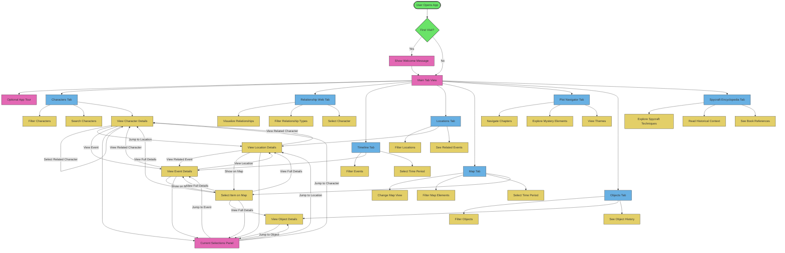

# Stitched Up Companion - User Interaction Flow

This diagram illustrates how users interact with the different components of the Stitched Up Companion app, showing the flow of actions and navigation between different parts of the application.

## User Journey

The diagram illustrates the common user journeys through the application:

1. **Initial Entry**: User opens the app, possibly sees a welcome message if it's their first visit
2. **Tab Navigation**: User selects between the various content tabs
3. **Content Exploration**: Within each tab, users can:
   - Filter and search for specific content
   - View detailed information about items
   - Select related elements
4. **Cross-Tab Navigation**: Users can jump between tabs through:
   - Selecting related elements (like a character in an event)
   - Using the Current Selections panel to navigate between selected items
   - Map-based exploration connecting locations, events, and characters

## Key Interaction Points

- **Tab Controls**: The main navigation mechanism for the application
- **Content Filters**: Allow users to narrow down what they're viewing
- **Detail Views**: Show comprehensive information about selected items
- **Selection Panel**: Provides quick access to currently selected elements
- **Cross-References**: Allow navigation between related content
